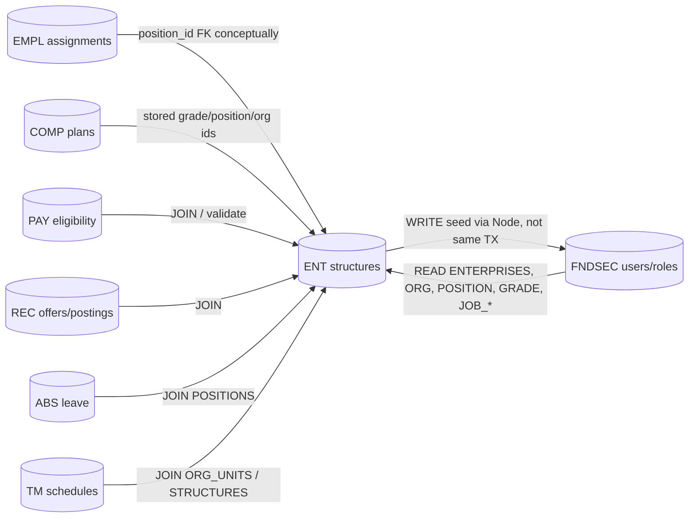

# Enterprise Dependency Graph

## Source-level (Node imports)

```mermaid
flowchart TB
  subgraph host [ERP host]
    indexJs[index.js mounts]
    mw[enterpriseContextMiddleware]
    auth[authMiddleware]
    currencySvc[src/services/currency.service]
  end

  subgraph ent [Enterprise Structure]
    facade[enterprise.facade]
    resolve[resolveEnterpriseBySubdomain]
    currenciesModel[CurrenciesModel]
    posConst[positions_constants]
    entCtrl[enterpriseController]
    hierCtrl[hrOrgHierarchyLevelController]
    gradesCtrl[grades_controller]
    lookups[look_ups/ent]
  end

  subgraph others [Other domains]
    empl[Employee controller]
    tm[Time controllers/models]
    secAuth[fndsecPasswordResetService]
    recAuth[recCandidatePasswordResetService]
    payConst[Pay eligibility constants]
    secFacade[security.facade]
  end

  indexJs --> ent
  mw --> resolve
  currencySvc --> currenciesModel
  empl --> facade
  tm --> facade
  secAuth --> facade
  recAuth --> facade
  payConst --> posConst
  gradesCtrl --> lookups
  entCtrl --> secFacade
  hierCtrl --> secFacade
```

No load-time cycle through facades: `enterprise.facade.js` does **not** import `security.facade.js`. The feature-level cycle is **controllers → Security** and **Security password-reset → facade**.

---

## Cycles classified

| Pair | Source | Database | Runtime | Verdict |
| --- | --- | --- | --- | --- |
| Enterprise → Security | controllers call admin seed | FNDSEC_USERS FK on delete | seed after create | **Soft cycle, HIGH coupling, not a load cycle** |
| Security → Enterprise | password-reset facade; data-role SQL | ENT existence checks | email + data roles | one-way reads |
| Enterprise → Employee | none | possible `employees_assigned` in ENT_STATS_PKG | none in Node | **not circular in JS** |
| Employee → Enterprise | `getPositionById` | employee tables hold position ids | enrich GET | one-way |
| Enterprise → Compensation | none | none in ES JS | none | none |
| Compensation → Enterprise | none (IDs in COMP) | COMP JSON/columns; lookup SQL | eligibility | one-way data |
| Enterprise → Pay | none | none in ES JS | none | none |
| Pay → Enterprise | employment type constants | eligibility SQL/views | criteria UI | one-way |
| Enterprise → Recruitment | none | none in ES JS | none | none |
| Recruitment → Enterprise | facade + offer/posting SQL | ENT joins | emails + views | one-way |

---

## Database-level

---

## Import counts

| Direction | Count |
| --- | --- |
| Direct source imports **into** Enterprise from other business domains | **2 files** (both `security.facade`) |
| Direct source imports **from** Enterprise (excluding `index.js` mounts) | **11 files** |
| of which go through `enterprise.facade.js` | **8** |
| of which bypass the facade | **3** (middleware, currency.service, Pay constants) |

`index.js` imports 14 Enterprise routers for mounting — host wiring, not a domain consumer.

---

## Facade as future boundary

Today Compensation does not call the facade. After Enterprise is a package, Compensation should keep using COMP-owned IDs and only add facade calls if it needs **live** structure validation.

Time/Employee/Security/Recruitment already have the right *shape* (facade). Widen the facade so middleware and currency/Pay stop importing internals **before** deleting local Enterprise files.
